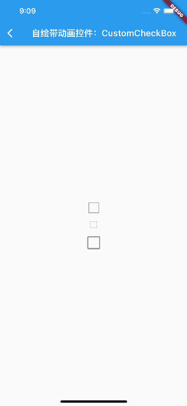
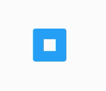

# 10.6 自绘组件：CustomCheckbox

Flutter 自带的 Checkbox 组件是不能自由指定大小的，本节我们通过自定义一个可以自由指定大小的 CustomCheckbox 组件来演示如何通过定义 RenderObject 的方式来自定义组件（而不是通过组合）。




1. 有选中和未选中两种状态。
2. 状态切换时要执行动画。
3. 可以自定义外观。

CustomCheckbox 定义如下：

```dart
class CustomCheckbox extends LeafRenderObjectWidget {
  CustomCheckbox({
    Key? key,
    this.strokeWidth = 2.0,
    this.value = false,
    this.strokeColor = Colors.white,
    this.fillColor = Colors.blue,
    this.radius = 2.0,
    this.onChanged,
  }) : super(key: key);

  final double strokeWidth; // “勾”的线条宽度
  final Color strokeColor; // “勾”的线条宽度
  final Color? fillColor; // 背景填充颜色
  final bool value; //选中状态
  final double radius; // 圆角
  final ValueChanged<bool>? onChanged; // 选中状态发生改变后的回调

  @override
  RenderObject createRenderObject(BuildContext context) {
    return RenderCustomCheckbox(
      strokeWidth,
      strokeColor,
      fillColor ?? Theme.of(context).primaryColor, // 填充颜色如果未指定则使用主题色
      value,
      radius,
      onChanged,
    );
  }

  @override
  void updateRenderObject(context, RenderCustomCheckbox renderObject) {
    if (renderObject.value != value) {
      //选中状态发生了变化，则需要调整动画状态以执行过渡动画
      renderObject.animationStatus =
          value ? AnimationStatus.forward : AnimationStatus.reverse;
    }
    renderObject
      ..strokeWidth = strokeWidth
      ..strokeColor = strokeColor
      ..fillColor = fillColor ?? Theme.of(context).primaryColor
      ..radius = radius
      ..value = value
      ..onChanged = onChanged;
  }
}
```

上面代码中唯一需要注意的就是 updateRenderObject 方法中当选中状态发生变化时，我们要更新RenderObject中的动画状态，具体逻辑是：当从未选中切换为选中状态时，执行正向动画；当从选中状态切换为未选中状态时执行反向动画。

接下来需要实现 RenderCustomCheckbox：

```dart
class RenderCustomCheckbox extends RenderBox {
  bool value;
  int pointerId = -1;
  double strokeWidth;
  Color strokeColor;
  Color fillColor;
  double radius;
  ValueChanged<bool>? onChanged;

  // 下面的属性用于调度动画
  double progress = 0; // 动画当前进度
  int? _lastTimeStamp;//上一次绘制的时间
  //动画执行时长
  Duration get duration => const Duration(milliseconds: 150);
  //动画当前状态
  AnimationStatus _animationStatus = AnimationStatus.completed;
  set animationStatus(AnimationStatus v) {
    if (_animationStatus != v) {
      markNeedsPaint();
    }
    _animationStatus = v;
  }

  //背景动画时长占比（背景动画要在前40%的时间内执行完毕，之后执行打勾动画）
  final double bgAnimationInterval = .4;

  RenderCustomCheckbox(this.strokeWidth, this.strokeColor, this.fillColor,
      this.value, this.radius, this.onChanged)
      : progress = value ? 1 : 0;
  
  @override
  void performLayout() {}  //布局

  @override
  void paint(PaintingContext context, Offset offset) {
    Rect rect = offset & size;
    // 将绘制分为背景（矩形）和 前景（打勾）两部分，先画背景，再绘制'勾'
    _drawBackground(context, rect);
    _drawCheckMark(context, rect);
    // 调度动画
    _scheduleAnimation();
  }
  
  // 画背景
  void _drawBackground(PaintingContext context, Rect rect) {}

  //画 "勾"
  void _drawCheckMark(PaintingContext context, Rect rect) { }
  //调度动画
  void _scheduleAnimation() {}

  ... //响应点击事件
}
```

### 实现布局算法

为了使用户可以自定义宽高，我们的布局策略是：如果父组件指定了固定宽高，则使用父组件指定的，否则宽高默认置为 25：

```dart
@override
void performLayout() {
  size = constraints.constrain(
    constraints.isTight ? Size.infinite : Size(25, 25),
  );
}
```

### 绘制 CustomCheckbox

记下来重点就是绘制 CustomCheckbox 了，为了清洗起见，我们将绘制分为背景（矩形）和 前景（打勾）两部分，先画背景，再绘制'勾'，这里需要注意两点：

1. 我们绘制的是动画执行过程中的一帧，所以需要通过动画执行的进度（progress）来计算每一帧要绘制的样子。
2. 当 CustomCheckbox 从未选中变为选中时，我们执行正向动画，progress 的值会从 0 逐渐变为 1，因为 CustomCheckbox 的背景和前景（'勾'）的颜色要有对比，所以我们在背景绘制完之后再绘制前景。因此，我们将动画分割为两端，前 40% 的时间画背景，后 60%的时间画'勾'。

#### 绘制背景

下面我们先看看如何绘制背景：

1. 当状态切换为选中状态时，将矩形逐渐从边缘向中心收缩填充，直到填满 Checkbox 区域。
2. 当状态切换为未选中状态时，填充从中间逐渐向边缘消散，直到只剩一个边框为止。



实现的思路是先将整个背景矩形区域全部填充满蓝色，然后在上面绘制一个白色背景的矩形，根据动画进度来动态改变白色矩形区域大小即可。幸运的是 Canvas API 中已经帮助我们实现了我们期望的功能，drawDRRect 他可以指定内外两个矩形，然后画出不相交的部分，并且可以指定圆角，下面是具体实现：

```dart
void _drawBackground(PaintingContext context, Rect rect) {
  Color color = value ? fillColor : Colors.grey;
  var paint = Paint()
    ..isAntiAlias = true
    ..style = PaintingStyle.fill //填充
    ..strokeWidth
    ..color = color;
  
  // 我们需要算出每一帧里面矩形的大小，为此我们可以直接根据矩形插值方法来确定里面矩形
  final outer = RRect.fromRectXY(rect, radius, radius);
  var rects = [
    rect.inflate(-strokeWidth),
    Rect.fromCenter(center: rect.center, width: 0, height: 0)
  ];
  // 根据动画执行进度调整来确定里面矩形在每一帧的大小
  var rectProgress = Rect.lerp(
    rects[0],
    rects[1],
    // 背景动画的执行时长是前 40% 的时间
    min(progress, bgAnimationInterval) / bgAnimationInterval,
  )!;
  final inner = RRect.fromRectXY(rectProgress, 0, 0);
  // 绘制
  context.canvas.drawDRRect(outer, inner, paint);
}
```

#### 绘制前景

前景是一个"勾"，它有三个点的连线构成，为了简单起见，我们将起始点和中点拐点的位置根据 Checkbox 的大小算出固定的坐标，然后我们在每一帧中动态调整第三个点的位置就可以实现打勾动画：

```dart
//画 "勾"
void _drawCheckMark(PaintingContext context, Rect rect) {
  // 在画好背景后再画前景
  if (progress > bgAnimationInterval) {
    
    //确定中间拐点位置
    final secondOffset = Offset(
      rect.left + rect.width / 2.5,
      rect.bottom - rect.height / 4,
    );
    // 第三个点的位置
    final lastOffset = Offset(
      rect.right - rect.width / 6,
      rect.top + rect.height / 4,
    );

    // 我们只对第三个点的位置做插值
    final _lastOffset = Offset.lerp(
      secondOffset,
      lastOffset,
      (progress - bgAnimationInterval) / (1 - bgAnimationInterval),
    )!;

    // 将三个点连起来
    final path = Path()
      ..moveTo(rect.left + rect.width / 7, rect.top + rect.height / 2)
      ..lineTo(secondOffset.dx, secondOffset.dy)
      ..lineTo(_lastOffset.dx, _lastOffset.dy);

    final paint = Paint()
      ..isAntiAlias = true
      ..style = PaintingStyle.stroke
      ..color = strokeColor
      ..strokeWidth = strokeWidth;

    context.canvas.drawPath(path, paint..style = PaintingStyle.stroke);
  }
}
```

### 调度动画

最后，我们需要让UI动起来，这时我们回想一下前面动画一章中的内容，会意识到 Flutter 的动画框架是依赖于 StatefulWidget 的，即当状态改变时显式或隐式的去调用 setState 触发更新。但是我们直接通过定义 RenderObject 的方式来实现的 CustomCheckbox，并不是基于 StatefulWidget ，那该怎么来调度动画呢？有两种办法：

1. 将 CustomCheckbox 用一个 StatefulWidget 包装起来，这样就可以复用之前介绍的执行动画的方法。
2. 自定义动画调度。

第一种方法相信读者已经很熟悉了，不再赘述，下面我们演示一下第二种方法，我们的思路是：在一帧绘制结束后判断动画是否结束，如果动画未结束，则将将当前组件标记为”需要重绘“，然后等待下一帧即可：

```dart
void _scheduleAnimation() {
  if (_animationStatus != AnimationStatus.completed) {
    // 需要在Flutter 当前frame 结束之前再执行，因为不能在绘制过程中又将组件标记为需要重绘
    SchedulerBinding.instance!.addPostFrameCallback((Duration timeStamp) {
      if (_lastTimeStamp != null) {
        double delta = (timeStamp.inMilliseconds - _lastTimeStamp!) /
          duration.inMilliseconds;
        // 如果是反向动画，则 progress值要逐渐减小
        if (_animationStatus == AnimationStatus.reverse) {
          delta = -delta;
        }
        //更新动画进度
        progress = progress + delta;
        
        if (progress >= 1 || progress <= 0) {
          //动画执行结束
          _animationStatus = AnimationStatus.completed;
          progress = progress.clamp(0, 1);
        }
      }
       //标记为需要重绘
      markNeedsPaint();
      _lastTimeStamp = timeStamp.inMilliseconds;
    });
  } else {
    _lastTimeStamp = null;
  }
}
```

### 响应点击事件

根据之前事件处理相关章节的介绍，如果我们要让渲染对象能处理事件，则它必须能通过命中测试，之后才能在 handleEvent 方法中处理事件，所以我们需要添加如下代码：

```dart
// 必须置为true，确保能通过命中测试
bool hitTestSelf(Offset position) => true;

// 只有通过命中测试，才会调用本方法，我们在手指抬起时触发事件即可
@override
void handleEvent(PointerEvent event, covariant BoxHitTestEntry entry) {
  if (event.down) {
    pointerId = event.pointer;
  } else if (pointerId == event.pointer) {
    // 手指抬起时触发回调
    onChanged?.call(!value);
  }
}
```

## 动画调度抽象 RenderObjectAnimationMixin

我们可以看到，在RenderObject 中调度动画还是比较复杂的，为此我们抽象了一个  RenderObjectAnimationMixin，如果还有其它 RenderObject 中需要执行动画，可以直接复用。

```dart
mixin RenderObjectAnimationMixin on RenderObject {
  double _progress = 0;
  int? _lastTimeStamp;


  // 动画时长，子类可以重写
  Duration get duration => const Duration(milliseconds: 200);
  AnimationStatus _animationStatus = AnimationStatus.completed;
  // 设置动画状态
  set animationStatus(AnimationStatus v) {
    if (_animationStatus != v) {
      markNeedsPaint();
    }
    _animationStatus = v;
  }
  
  double get progress => _progress;
  set progress(double v) {
    _progress = v.clamp(0, 1);
  }

  @override
  void paint(PaintingContext context, Offset offset) {
    doPaint(context, offset); // 调用子类绘制逻辑
    _scheduleAnimation();
  }

  void _scheduleAnimation() {
    if (_animationStatus != AnimationStatus.completed) {
      SchedulerBinding.instance!.addPostFrameCallback((Duration timeStamp) {
        if (_lastTimeStamp != null) {
          double delta = (timeStamp.inMilliseconds - _lastTimeStamp!) /
              duration.inMilliseconds;
          
          //在特定情况下，可能在一帧中连续的往frameCallback中添加了多次，导致两次回调时间间隔为0，
          //这种情况下应该继续请求重绘。
          if (delta == 0) {
            markNeedsPaint();
            return;
          }
          
          if (_animationStatus == AnimationStatus.reverse) {
            delta = -delta;
          }
          _progress = _progress + delta;
          if (_progress >= 1 || _progress <= 0) {
            _animationStatus = AnimationStatus.completed;
            _progress = _progress.clamp(0, 1);
          }
        }
        markNeedsPaint();
        _lastTimeStamp = timeStamp.inMilliseconds;
      });
    } else {
      _lastTimeStamp = null;
    }
  }

  // 子类实现绘制逻辑的地方
  void doPaint(PaintingContext context, Offset offset);
}
```

## CustomCheckbox 的完整源码

则最终 CustomCheckbox 的完整源码为

```dart
class CustomCheckbox extends LeafRenderObjectWidget {
  CustomCheckbox({
    Key? key,
    this.strokeWidth = 2.0,
    this.value = false,
    this.strokeColor = Colors.white,
    this.fillColor = Colors.blue,
    this.radius = 2.0,
    this.onChanged,
  }) : super(key: key);

  final double strokeWidth; // “勾”的线条宽度
  final Color strokeColor; // “勾”的线条宽度
  final Color? fillColor; // 填充颜色
  final bool value; //选中状态
  final double radius; // 圆角
  final ValueChanged<bool>? onChanged; // 选中状态发生改变后的回调

  @override
  RenderObject createRenderObject(BuildContext context) {
    return RenderCustomCheckbox(
      strokeWidth,
      strokeColor,
      fillColor ?? Theme.of(context).primaryColor,
      value,
      radius,
      onChanged,
    );
  }

  @override
  void updateRenderObject(context, RenderCustomCheckbox renderObject) {
    if (renderObject.value != value) {
      renderObject.animationStatus =
          value ? AnimationStatus.forward : AnimationStatus.reverse;
    }
    renderObject
      ..strokeWidth = strokeWidth
      ..strokeColor = strokeColor
      ..fillColor = fillColor ?? Theme.of(context).primaryColor
      ..radius = radius
      ..value = value
      ..onChanged = onChanged;
  }
}
// 动画调度相关逻辑直接 with  RenderObjectAnimationMixin即可
class RenderCustomCheckbox extends RenderBox with RenderObjectAnimationMixin {
  bool value;
  int pointerId = -1;
  double strokeWidth;
  Color strokeColor;
  Color fillColor;
  double radius;
  ValueChanged<bool>? onChanged;

  RenderCustomCheckbox2(this.strokeWidth, this.strokeColor, this.fillColor,
      this.value, this.radius, this.onChanged) {
    progress = value ? 1 : 0;
  }

  @override
  bool get isRepaintBoundary => true;

  //背景动画时长占比（背景动画要在前40%的时间内执行完毕，之后执行打勾动画）
  final double bgAnimationInterval = .4;

  @override
  void doPaint(PaintingContext context, Offset offset) {
    Rect rect = offset & size;
    _drawBackground(context, rect);
    _drawCheckMark(context, rect);
  }

  void _drawBackground(PaintingContext context, Rect rect) {
    Color color = value ? fillColor : Colors.grey;
    var paint = Paint()
      ..isAntiAlias = true
      ..style = PaintingStyle.fill //填充
      ..strokeWidth
      ..color = color;

    // 我们对矩形做插值
    final outer = RRect.fromRectXY(rect, radius, radius);
    var rects = [
      rect.inflate(-strokeWidth),
      Rect.fromCenter(center: rect.center, width: 0, height: 0)
    ];
    var rectProgress = Rect.lerp(
      rects[0],
      rects[1],
      min(progress, bgAnimationInterval) / bgAnimationInterval,
    )!;

    final inner = RRect.fromRectXY(rectProgress, 0, 0);
    // 画背景
    context.canvas.drawDRRect(outer, inner, paint);
  }

  //画 "勾"
  void _drawCheckMark(PaintingContext context, Rect rect) {
    // 在画好背景后再画前景
    if (progress > bgAnimationInterval) {

      //确定中间拐点位置
      final secondOffset = Offset(
        rect.left + rect.width / 2.5,
        rect.bottom - rect.height / 4,
      );
      // 第三个点的位置
      final lastOffset = Offset(
        rect.right - rect.width / 6,
        rect.top + rect.height / 4,
      );

      // 我们只对第三个点的位置做插值
      final _lastOffset = Offset.lerp(
        secondOffset,
        lastOffset,
        (progress - bgAnimationInterval) / (1 - bgAnimationInterval),
      )!;

      // 将三个点连起来
      final path = Path()
        ..moveTo(rect.left + rect.width / 7, rect.top + rect.height / 2)
        ..lineTo(secondOffset.dx, secondOffset.dy)
        ..lineTo(_lastOffset.dx, _lastOffset.dy);

      final paint = Paint()
        ..isAntiAlias = true
        ..style = PaintingStyle.stroke
        ..color = strokeColor
        ..strokeWidth = strokeWidth;

      context.canvas.drawPath(path, paint..style = PaintingStyle.stroke);
    }
  }

  @override
  void performLayout() {
    // 如果父组件指定了固定宽高，则使用父组件指定的，否则宽高默认置为 25
    size = constraints.constrain(
      constraints.isTight ? Size.infinite : Size(25, 25),
    );
  }

  // 必须置为true，否则不可以响应事件
  bool hitTestSelf(Offset position) => true;

  // 只有通过点击测试的组件才会调用本方法
  @override
  void handleEvent(PointerEvent event, covariant BoxHitTestEntry entry) {
    if (event.down) {
      pointerId = event.pointer;
    } else if (pointerId == event.pointer) {
      // 判断手指抬起时是在组件范围内的话才触发onChange
      if(size.contains(event.localPosition)) {
        onChanged?.call(!value);
      }
    }
  }
}
```

测试代码如下：我们创建三个大小不同的复选框，点击其中任意一个，另外两个复选框的状态也会跟着联动：

```dart
class CustomCheckboxTest extends StatefulWidget {
  const CustomCheckboxTest({Key? key}) : super(key: key);

  @override
  State<CustomCheckboxTest> createState() => _CustomCheckboxTestState();
}

class _CustomCheckboxTestState extends State<CustomCheckboxTest> {
  bool _checked = false;

  @override
  Widget build(BuildContext context) {
    return Center(
      child: Column(mainAxisAlignment: MainAxisAlignment.center,
        children: [
          CustomCheckbox2(
            value: _checked,
            onChanged: _onChange,
          ),
          Padding(
            padding: const EdgeInsets.all(18.0),
            child: SizedBox(
              width: 16,
              height: 16,
              child: CustomCheckbox(
                strokeWidth: 1,
                radius: 1,
                value: _checked,
                onChanged: _onChange,
              ),
            ),
          ),
          SizedBox(
            width: 30,
            height: 30,
            child: CustomCheckbox(
              strokeWidth: 3,
              radius: 3,
              value: _checked,
              onChanged: _onChange,
            ),
          ),
        ],
      ),
    );
  }

  void _onChange(value) {
    setState(() => _checked = value);
  }
}
```

## 总结

本节演示了如何通过自定义 RenderObject 的方式来进行UI绘制、动画调度和事件处理。

