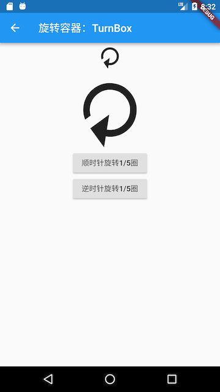

# 10.3 组合实例：TurnBox

我们之前已经介绍过`RotatedBox`，它可以旋转子组件，但是它有两个缺点：一是只能将其子节点以90度的倍数旋转；二是当旋转的角度发生变化时，旋转角度更新过程没有动画。

本节我们将实现一个`TurnBox`组件，它不仅可以以任意角度来旋转其子节点，而且可以在角度发生变化时执行一个动画以过渡到新状态，同时，我们可以手动指定动画速度。

`TurnBox`的完整代码如下：

```dart
import 'package:flutter/widgets.dart';

class TurnBox extends StatefulWidget {
  const TurnBox({
    Key key,
    this.turns = .0, //旋转的“圈”数,一圈为360度，如0.25圈即90度
    this.speed = 200, //过渡动画执行的总时长
    this.child
  }) :super(key: key);

  final double turns;
  final int speed;
  final Widget child;

  @override
  _TurnBoxState createState() => _TurnBoxState();
}

class _TurnBoxState extends State<TurnBox>
    with SingleTickerProviderStateMixin {
  AnimationController _controller;

  @override
  void initState() {
    super.initState();
    _controller = AnimationController(
        vsync: this,
        lowerBound: -double.infinity,
        upperBound: double.infinity
    );
    _controller.value = widget.turns;
  }

  @override
  void dispose() {
    _controller.dispose();
    super.dispose();
  }

  @override
  Widget build(BuildContext context) {
    return RotationTransition(
      turns: _controller,
      child: widget.child,
    );
  }

  @override
  void didUpdateWidget(TurnBox oldWidget) {
    super.didUpdateWidget(oldWidget);
    //旋转角度发生变化时执行过渡动画
    if (oldWidget.turns != widget.turns) {
      _controller.animateTo(
        widget.turns,
        duration: Duration(milliseconds: widget.speed??200),
        curve: Curves.easeOut,
      );
    }
  }
}
```

上面代码中：

1. 我们是通过组合`RotationTransition`和child来实现的旋转效果。
2. 在`didUpdateWidget`中，我们判断要旋转的角度是否发生了变化，如果变了，则执行一个过渡动画。

下面我们测试一下`TurnBox`的功能，测试代码如下：

```dart
import 'package:flutter/material.dart';
import '../widgets/index.dart';

class TurnBoxRoute extends StatefulWidget {
  @override
  _TurnBoxRouteState createState() => _TurnBoxRouteState();
}

class _TurnBoxRouteState extends State<TurnBoxRoute> {
  double _turns = .0;

  @override
  Widget build(BuildContext context) {

    return Center(
      child: Column(
        children: <Widget>[
          TurnBox(
            turns: _turns,
            speed: 500,
            child: Icon(Icons.refresh, size: 50,),
          ),
          TurnBox(
            turns: _turns,
            speed: 1000,
            child: Icon(Icons.refresh, size: 150.0,),
          ),
          RaisedButton(
            child: Text("顺时针旋转1/5圈"),
            onPressed: () {
              setState(() {
                _turns += .2;
              });
            },
          ),
          RaisedButton(
            child: Text("逆时针旋转1/5圈"),
            onPressed: () {
              setState(() {
                _turns -= .2;
              });
            },
          )
        ],
      ),
    );
  }
}
```

测试代码运行后效果如图10-2所示：




当我们点击旋转按钮时，两个图标的旋转都会旋转1/5圈，但旋转的速度是不同的，读者可以自己运行一下示例看看效果。

实际上本示例只组合了`RotationTransition`一个组件，它是一个最简的组合类组件示例。另外，如果我们封装的是`StatefulWidget`，那么一定要注意在组件更新时是否需要同步状态。比如我们要封装一个富文本展示组件`MyRichText` ，它可以自动处理url链接，定义如下：

```dart
class MyRichText extends StatefulWidget {
  MyRichText({
    Key key,
    this.text, // 文本字符串
    this.linkStyle, // url链接样式
  }) : super(key: key);

  final String text;
  final TextStyle linkStyle;

  @override
  _MyRichTextState createState() => _MyRichTextState();
}
```

接下来我们在`_MyRichTextState`中要实现的功能有两个：

1. 解析文本字符串“text”，生成`TextSpan`缓存起来；
2. 在`build`中返回最终的富文本样式；

`_MyRichTextState` 实现的代码大致如下：

```dart
class _MyRichTextState extends State<MyRichText> {

  TextSpan _textSpan;

  @override
  Widget build(BuildContext context) {
    return RichText(
      text: _textSpan,
    );
  }

  TextSpan parseText(String text) {
    // 耗时操作：解析文本字符串，构建出TextSpan。
    // 省略具体实现。
  }

  @override
  void initState() {
    _textSpan = parseText(widget.text)
    super.initState();
  }
}
```

由于解析文本字符串，构建出`TextSpan`是一个耗时操作，为了不在每次build的时候都解析一次，所以我们在`initState`中对解析的结果进行了缓存，然后再`build`中直接使用解析的结果`_textSpan`。这看起来很不错，但是上面的代码有一个严重的问题，就是父组件传入的`text`发生变化时（组件树结构不变），那么`MyRichText`显示的内容不会更新，原因就是`initState`只会在State创建时被调用，所以在`text`发生变化时，`parseText`没有重新执行，导致`_textSpan`任然是旧的解析值。要解决这个问题也很简单，我们只需添加一个`didUpdateWidget`回调，然后再里面重新调用`parseText`即可：

```dart
@override
void didUpdateWidget(MyRichText oldWidget) {
  if (widget.text != oldWidget.text) {
    _textSpan = parseText(widget.text);
  }
  super.didUpdateWidget(oldWidget);
}
```

有些读者可能会觉得这个点也很简单，是的，的确很简单，之所以要在这里反复强调是因为这个点在实际开发中很容易被忽略，它虽然简单，但却很重要。总之，当我们在State中会缓存某些依赖Widget参数的数据时，一定要注意在组件更新时是否需要同步状态。
