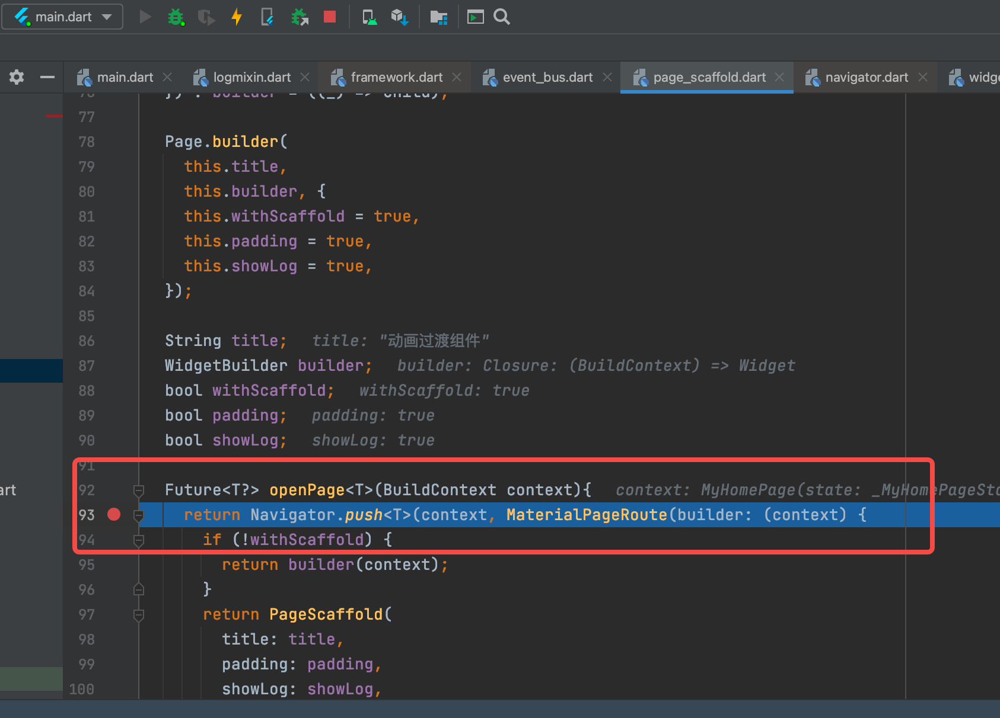

# 2.7 调试Flutter应用

有各种各样的工具和功能来帮助调试Flutter应用程序。

## 日志与断点

### `debugger()` 声明

当使用Dart Observatory（或另一个Dart调试器，例如IntelliJ IDE中的调试器）时，可以使用该`debugger()`语句插入编程式断点。要使用这个，你必须添加`import 'dart:developer';`到相关文件顶部。

`debugger()`语句采用一个可选`when`参数，我们可以指定该参数仅在特定条件为真时中断，如下所示：

```dart
void someFunction(double offset) {
  debugger(when: offset > 30.0);
  // ...
}
```

### `print`、`debugPrint`、`flutter logs`

Dart `print()`功能将输出到系统控制台，我们可以使用`flutter logs`来查看它（基本上是一个包装`adb logcat`）。

如果你一次输出太多，那么Android有时会丢弃一些日志行。为了避免这种情况，我们可以使用Flutter的`foundation`库中的[`debugPrint()`](https://docs.flutter.io/flutter/foundation/debugPrint.html)。 这是一个封装print，它将输出限制在一个级别，避免被Android内核丢弃。

Flutter框架中的许多类都有`toString`实现。按照惯例，这些输出通常包括对象的`runtimeType`单行输出，通常在表单中ClassName(more information about this instance…)。 树中使用的一些类也具有`toStringDeep`，从该点返回整个子树的多行描述。已一些具有详细信息`toString`的类会实现一个`toStringShort`，它只返回对象的类型或其他非常简短的（一个或两个单词）描述。

### 调试模式断言

在Flutter应用调试过程中，Dart `assert`语句被启用，并且 Flutter 框架使用它来执行许多运行时检查来验证是否违反一些不可变的规则。当一个某个规则被违反时，就会在控制台打印错误日志，并带上一些上下文信息来帮助追踪问题的根源。

要关闭调试模式并使用发布模式，请使用`flutter run --release`运行我们的应用程序。 这也关闭了Observatory调试器。一个中间模式可以关闭除Observatory之外所有调试辅助工具的，称为“profile mode”，用`--profile`替代`--release`即可。

### 断点

开发过程中，断点是最实用的调试工具之一，我们以 Android Studio 为例，如图2-19：



我们在 93 行打了一个断点，一旦代码执行到这一行就会暂停，这时我们可以看到当前上下文所有变量的值，然后可以选择一步一步的执行代码。关于如果通过 IDE 来打断点，网上教程很多，读者可以自行搜索。

## 调试应用程序层

Flutter框架的每一层都提供了将其当前状态或事件转储(dump)到控制台（使用`debugPrint`）的功能。

#### Widget 树

要转储Widgets树的状态，请调用[`debugDumpApp()`](https://docs.flutter.io/flutter/widgets/debugDumpApp.html)。 只要应用程序已经构建了至少一次（即在调用`build()`之后的任何时间），我们可以在应用程序未处于构建阶段（即，不在`build()`方法内调用 ）的任何时间调用此方法（在调用`runApp()`之后）。

如, 这个应用程序:

```dart
import 'package:flutter/material.dart';

void main() {
  runApp(
    MaterialApp(
      home: AppHome(),
    ),
  );
}

class AppHome extends StatelessWidget {
  @override
  Widget build(BuildContext context) {
    return Material(
      child: Center(
        child: TextButton(
          onPressed: () {
            debugDumpApp();
          },
          child: Text('Dump App'),
        ),
      ),
    );
  }
}
```

…会输出这样的内容（精确的细节会根据框架的版本、设备的大小等等而变化）：

```shell
I/flutter ( 6559): WidgetsFlutterBinding - CHECKED MODE
I/flutter ( 6559): RenderObjectToWidgetAdapter<RenderBox>([GlobalObjectKey RenderView(497039273)]; renderObject: RenderView)
I/flutter ( 6559): └MaterialApp(state: _MaterialAppState(1009803148))
I/flutter ( 6559):  └ScrollConfiguration()
I/flutter ( 6559):   └AnimatedTheme(duration: 200ms; state: _AnimatedThemeState(543295893; ticker inactive; ThemeDataTween(ThemeData(Brightness.light Color(0xff2196f3) etc...) → null)))
I/flutter ( 6559):    └Theme(ThemeData(Brightness.light Color(0xff2196f3) etc...))
I/flutter ( 6559):     └WidgetsApp([GlobalObjectKey _MaterialAppState(1009803148)]; state: _WidgetsAppState(552902158))
I/flutter ( 6559):      └CheckedModeBanner()
I/flutter ( 6559):       └Banner()
I/flutter ( 6559):        └CustomPaint(renderObject: RenderCustomPaint)
I/flutter ( 6559):         └DefaultTextStyle(inherit: true; color: Color(0xd0ff0000); family: "monospace"; size: 48.0; weight: 900; decoration: double Color(0xffffff00) TextDecoration.underline)
I/flutter ( 6559):          └MediaQuery(MediaQueryData(size: Size(411.4, 683.4), devicePixelRatio: 2.625, textScaleFactor: 1.0, padding: EdgeInsets(0.0, 24.0, 0.0, 0.0)))
I/flutter ( 6559):           └LocaleQuery(null)
I/flutter ( 6559):            └Title(color: Color(0xff2196f3))
... #省略剩余内容
```

这是一个“扁平化”的树，显示了通过各种构建函数投影的所有widget（如果你在widget树的根中调用`toStringDeepwidget`，这是你获得的树）。 你会看到很多在你的应用源代码中没有出现的widget，因为它们是被框架中widget的`build()`函数插入的。例如，[`InkFeature`](https://docs.flutter.io/flutter/material/InkFeature-class.html)是Material widget的一个实现细节 。

当按钮从被按下变为被释放时debugDumpApp()被调用，TextButton对象同时调用`setState()`，并将自己标记为"dirty"。 这就是为什么如果你看转储，你会看到特定的对象标记为“dirty”。我们还可以查看已注册了哪些手势监听器; 在这种情况下，一个单一的GestureDetector被列出，并且监听“tap”手势（“tap”是`TapGestureDetector`的`toStringShort`函数输出的）

如果我们编写自己的widget，则可以通过覆盖[`debugFillProperties()`](https://docs.flutter.io/flutter/widgets/Widget/debugFillProperties.html)来添加信息。 将[DiagnosticsProperty](https://docs.flutter.io/flutter/foundation/DiagnosticsProperty-class.html)对象作为方法参数，并调用父类方法。 该函数是该`toString`方法用来填充小部件描述信息的。

#### 渲染树

如果我们尝试调试布局问题，那么Widget树可能不够详细。在这种情况下，我们可以通过调用`debugDumpRenderTree()`转储渲染树。 正如`debugDumpApp()`，除布局或绘制阶段外，我们可以随时调用此函数。作为一般规则，从[frame 回调](https://docs.flutter.io/flutter/scheduler/SchedulerBinding/addPersistentFrameCallback.html) 或事件处理器中调用它是最佳解决方案。

要调用`debugDumpRenderTree()`，我们需要添加`import'package:flutter/rendering.dart';`到我们的源文件。

上面这个小例子的输出结果如下所示：

```shell
I/flutter ( 6559): RenderView
I/flutter ( 6559):  │ debug mode enabled - android
I/flutter ( 6559):  │ window size: Size(1080.0, 1794.0) (in physical pixels)
I/flutter ( 6559):  │ device pixel ratio: 2.625 (physical pixels per logical pixel)
I/flutter ( 6559):  │ configuration: Size(411.4, 683.4) at 2.625x (in logical pixels)
I/flutter ( 6559):  │
I/flutter ( 6559):  └─child: RenderCustomPaint
I/flutter ( 6559):    │ creator: CustomPaint ← Banner ← CheckedModeBanner ←
I/flutter ( 6559):    │   WidgetsApp-[GlobalObjectKey _MaterialAppState(1009803148)] ←
I/flutter ( 6559):    │   Theme ← AnimatedTheme ← ScrollConfiguration ← MaterialApp ←
I/flutter ( 6559):    │   [root]
I/flutter ( 6559):    │ parentData: <none>
I/flutter ( 6559):    │ constraints: BoxConstraints(w=411.4, h=683.4)
I/flutter ( 6559):    │ size: Size(411.4, 683.4)
... # 省略
```

这是根`RenderObject`对象的`toStringDeep`函数的输出。

当调试布局问题时，关键要看的是`size`和`constraints`字段。约束沿着树向下传递，尺寸向上传递。

如果我们编写自己的渲染对象，则可以通过覆盖[`debugFillProperties()`](https://docs.flutter.io/flutter/rendering/Layer/debugFillProperties.html)将信息添加到转储。 将[DiagnosticsProperty](https://docs.flutter.io/flutter/foundation/DiagnosticsProperty-class.html)对象作为方法的参数，并调用父类方法。

#### Layer树

读者可以理解为渲染树是可以分层的，而最终绘制需要将不同的层合成起来，而Layer则是绘制时需要合成的层，如果我们尝试调试合成问题，则可以使用[`debugDumpLayerTree()`](https://docs.flutter.io/flutter/rendering/debugDumpLayerTree.html)。对于上面的例子，它会输出：

```
I/flutter : TransformLayer
I/flutter :  │ creator: [root]
I/flutter :  │ offset: Offset(0.0, 0.0)
I/flutter :  │ transform:
I/flutter :  │   [0] 3.5,0.0,0.0,0.0
I/flutter :  │   [1] 0.0,3.5,0.0,0.0
I/flutter :  │   [2] 0.0,0.0,1.0,0.0
I/flutter :  │   [3] 0.0,0.0,0.0,1.0
I/flutter :  │
I/flutter :  ├─child 1: OffsetLayer
I/flutter :  │ │ creator: RepaintBoundary ← _FocusScope ← Semantics ← Focus-[GlobalObjectKey MaterialPageRoute(560156430)] ← _ModalScope-[GlobalKey 328026813] ← _OverlayEntry-[GlobalKey 388965355] ← Stack ← Overlay-[GlobalKey 625702218] ← Navigator-[GlobalObjectKey _MaterialAppState(859106034)] ← Title ← ⋯
I/flutter :  │ │ offset: Offset(0.0, 0.0)
I/flutter :  │ │
I/flutter :  │ └─child 1: PictureLayer
I/flutter :  │
I/flutter :  └─child 2: PictureLayer
```

这是根`Layer`的`toStringDeep`输出的。

根部的变换是应用设备像素比的变换; 在这种情况下，每个逻辑像素代表3.5个设备像素。

`RepaintBoundary` widget在渲染树的层中创建了一个`RenderRepaintBoundary`。这用于减少需要重绘的需求量。

### 语义

我们还可以调用[`debugDumpSemanticsTree()`](https://docs.flutter.io/flutter/rendering/debugDumpSemanticsTree.html)获取语义树（呈现给系统可访问性API的树）的转储。 要使用此功能，必须首先启用辅助功能，例如启用系统辅助工具或`SemanticsDebugger` （下面讨论）。

对于上面的例子，它会输出:

```
I/flutter : SemanticsNode(0; Rect.fromLTRB(0.0, 0.0, 411.4, 683.4))
I/flutter :  ├SemanticsNode(1; Rect.fromLTRB(0.0, 0.0, 411.4, 683.4))
I/flutter :  │ └SemanticsNode(2; Rect.fromLTRB(0.0, 0.0, 411.4, 683.4); canBeTapped)
I/flutter :  └SemanticsNode(3; Rect.fromLTRB(0.0, 0.0, 411.4, 683.4))
I/flutter :    └SemanticsNode(4; Rect.fromLTRB(0.0, 0.0, 82.0, 36.0); canBeTapped; "Dump App")
```

### 调度

要找出相对于帧的开始/结束事件发生的位置，可以切换[`debugPrintBeginFrameBanner`](https://docs.flutter.io/flutter/scheduler/debugPrintBeginFrameBanner.html)和[`debugPrintEndFrameBanner`](https://docs.flutter.io/flutter/scheduler/debugPrintEndFrameBanner.html)布尔值以将帧的开始和结束打印到控制台。

例如:

```
I/flutter : ▄▄▄▄▄▄▄▄ Frame 12         30s 437.086ms ▄▄▄▄▄▄▄▄
I/flutter : Debug print: Am I performing this work more than once per frame?
I/flutter : Debug print: Am I performing this work more than once per frame?
I/flutter : ▀▀▀▀▀▀▀▀▀▀▀▀▀▀▀▀▀▀▀▀▀▀▀▀▀▀▀▀▀▀▀▀▀▀▀▀▀▀▀▀▀▀▀▀▀▀▀▀▀▀▀▀
```

[`debugPrintScheduleFrameStacks`](https://docs.flutter.io/flutter/scheduler/debugPrintScheduleFrameStacks.html)还可以用来打印导致当前帧被调度的调用堆栈。

### 可视化调试

我们也可以通过设置`debugPaintSizeEnabled`为`true`以可视方式调试布局问题。 这是来自`rendering`库的布尔值。它可以在任何时候启用，并在为true时影响绘制。 设置它的最简单方法是在`void main()`的顶部设置。

当它被启用时，所有的盒子都会得到一个明亮的深青色边框，padding（来自widget如Padding）显示为浅蓝色，子widget周围有一个深蓝色框， 对齐方式（来自widget如Center和Align）显示为黄色箭头. 空白（如没有任何子节点的Container）以灰色显示。

[`debugPaintBaselinesEnabled`](https://docs.flutter.io/flutter/rendering/debugPaintBaselinesEnabled.html)做了类似的事情，但对于具有基线的对象，文字基线以绿色显示，表意(ideographic)基线以橙色显示。

[`debugPaintPointersEnabled`](https://docs.flutter.io/flutter/rendering/debugPaintPointersEnabled.html)标志打开一个特殊模式，任何正在点击的对象都会以深青色突出显示。 这可以帮助我们确定某个对象是否以某种不正确的方式进行hit测试（Flutter检测点击的位置是否有能响应用户操作的widget）,例如，如果它实际上超出了其父项的范围，首先不会考虑通过hit测试。

如果我们尝试调试合成图层，例如以确定是否以及在何处添加`RepaintBoundary` widget，则可以使用[`debugPaintLayerBordersEnabled`](https://docs.flutter.io/flutter/rendering/debugPaintLayerBordersEnabled.html) 标志， 该标志用橙色或轮廓线标出每个层的边界，或者使用[`debugRepaintRainbowEnabled`](https://docs.flutter.io/flutter/rendering/debugRepaintRainbowEnabled.html)标志， 只要他们重绘时，这会使该层被一组旋转色所覆盖。

所有这些标志只能在调试模式下工作。通常，Flutter框架中以“`debug...`” 开头的任何内容都只能在调试模式下工作。

### 调试动画

调试动画最简单的方法是减慢它们的速度。为此，请将[`timeDilation`](https://docs.flutter.io/flutter/scheduler/timeDilation.html)变量（在scheduler库中）设置为大于1.0的数字，例如50.0。 最好在应用程序启动时只设置一次。如果我们在运行中更改它，尤其是在动画运行时将其值改小，则在观察时可能会出现倒退，这可能会导致断言命中，并且这通常会干扰我们的开发工作。

### 调试性能问题

要了解我们的应用程序导致重新布局或重新绘制的原因，我们可以分别设置[`debugPrintMarkNeedsLayoutStacks`](https://docs.flutter.io/flutter/rendering/debugPrintMarkNeedsLayoutStacks.html)和 [`debugPrintMarkNeedsPaintStacks`](https://docs.flutter.io/flutter/rendering/debugPrintMarkNeedsPaintStacks.html)标志。 每当渲染盒被要求重新布局和重新绘制时，这些都会将堆栈跟踪记录到控制台。如果这种方法对我们有用，我们可以使用`services`库中的`debugPrintStack()`方法按需打印堆栈痕迹。

### 统计应用启动时间

要收集有关Flutter应用程序启动所需时间的详细信息，可以在运行`flutter run`时使用`trace-startup`和`profile`选项。

```shell
$ flutter run --trace-startup --profile
```

跟踪输出保存为`start_up_info.json`，在Flutter工程目录在build目录下。输出列出了从应用程序启动到这些跟踪事件（以微秒捕获）所用的时间：

- 进入Flutter引擎时.
- 展示应用第一帧时.
- 初始化Flutter框架时.
- 完成Flutter框架初始化时.

如 :

```json
{
  "engineEnterTimestampMicros": 96025565262,
  "timeToFirstFrameMicros": 2171978,
  "timeToFrameworkInitMicros": 514585,
  "timeAfterFrameworkInitMicros": 1657393
}
```

### 跟踪Dart代码性能

要执行自定义性能跟踪和测量Dart任意代码段的wall/CPU时间（类似于在Android上使用[systrace](https://developer.android.com/studio/profile/systrace.html)）。 使用`dart:developer`的[Timeline](https://api.dartlang.org/stable/dart-developer/Timeline-class.html)工具来包含你想测试的代码块，例如：

```dart
Timeline.startSync('interesting function');
// iWonderHowLongThisTakes();
Timeline.finishSync();
```

然后打开你应用程序的Observatory timeline页面，在“Recorded Streams”中选择‘Dart’复选框，并执行你想测量的功能。

刷新页面将在Chrome的[跟踪工具](https://www.chromium.org/developers/how-tos/trace-event-profiling-tool)中显示应用按时间顺序排列的timeline记录。

请确保运行`flutter run`时带有`--profile`标志，以确保运行时性能特征与我们的最终产品差异最小。

## DevTools

Flutter DevTools 是 Flutter 可视化调试工具，如图2-20。它将各种调试工具和能力集成在一起，并提供可视化调试界面，它的功能很强大，掌握它会对我们开发和优化 Flutter 应用有很大帮助。由于 Flutter DevTools 功能很多，短篇幅是讲不完的，本书不做专门介绍，Flutter 官网对 DevTools 有详细的介绍，读者可以去官网查看相关教程。


