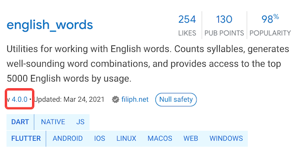

# 2.8 Flutter异常捕获

在介绍Flutter异常捕获之前必须先了解一下Dart单线程模型，只有了解了Dart的代码执行流程，我们才能知道该在什么地方去捕获异常。

## 2.8.1 Dart单线程模型

在 Java 和 Objective-C（以下简称“OC”）中，如果程序发生异常且没有被捕获，那么程序将会终止，但是这在Dart或JavaScript中则不会！究其原因，这和它们的运行机制有关系。Java 和 OC 都是多线程模型的编程语言，任意一个线程触发异常且该异常未被捕获时，就会导致整个进程退出。但 Dart 和 JavaScript 不会，它们都是单线程模型，运行机制很相似(但有区别)，下面我们通过Dart官方提供的一张图来看看 Dart 大致运行原理：




Dart 在单线程中是以消息循环机制来运行的，其中包含两个任务队列，一个是“微任务队列”  **microtask queue**，另一个叫做“事件队列” **event queue**。从图中可以发现，微任务队列的执行优先级高于事件队列。

现在我们来介绍一下Dart线程运行过程，如上图中所示，入口函数 main() 执行完后，消息循环机制便启动了。首先会按照先进先出的顺序逐个执行微任务队列中的任务，事件任务执行完毕后程序便会退出，但是，在事件任务执行的过程中也可以插入新的微任务和事件任务，在这种情况下，整个线程的执行过程便是一直在循环，不会退出，而Flutter中，主线程的执行过程正是如此，永不终止。

在Dart中，所有的外部事件任务都在事件队列中，如IO、计时器、点击、以及绘制事件等，而微任务通常来源于Dart内部，并且微任务非常少，之所以如此，是因为微任务队列优先级高，如果微任务太多，执行时间总和就越久，事件队列任务的延迟也就越久，对于GUI应用来说最直观的表现就是比较卡，所以必须得保证微任务队列不会太长。值得注意的是，我们可以通过`Future.microtask(…)`方法向微任务队列插入一个任务。

在事件循环中，当某个任务发生异常并没有被捕获时，程序并不会退出，而直接导致的结果是**当前任务**的后续代码就不会被执行了，也就是说一个任务中的异常是不会影响其它任务执行的。


## 2.8.2 Flutter异常捕获

Dart中可以通过`try/catch/finally`来捕获代码块异常，这个和其它编程语言类似，如果读者不清楚，可以查看Dart语言文档，不再赘述，下面我们看看Flutter中的异常捕获。

### Flutter框架异常捕获

Flutter 框架为我们在很多关键的方法进行了异常捕获。这里举一个例子，当我们布局发生越界或不合规范时，Flutter就会自动弹出一个错误界面，这是因为Flutter已经在执行build方法时添加了异常捕获，最终的源码如下：

```dart
@override
void performRebuild() {
 ...
  try {
    //执行build方法  
    built = build();
  } catch (e, stack) {
    // 有异常时则弹出错误提示  
    built = ErrorWidget.builder(_debugReportException('building $this', e, stack));
  } 
  ...
}      
```

可以看到，在发生异常时，Flutter默认的处理方式是弹一个ErrorWidget，但如果我们想自己捕获异常并上报到报警平台的话应该怎么做？我们进入`_debugReportException()`方法看看：

```dart
FlutterErrorDetails _debugReportException(
  String context,
  dynamic exception,
  StackTrace stack, {
  InformationCollector informationCollector
}) {
  //构建错误详情对象  
  final FlutterErrorDetails details = FlutterErrorDetails(
    exception: exception,
    stack: stack,
    library: 'widgets library',
    context: context,
    informationCollector: informationCollector,
  );
  //报告错误 
  FlutterError.reportError(details);
  return details;
}
```

我们发现，错误是通过`FlutterError.reportError`方法上报的，继续跟踪：

```dart

static void reportError(FlutterErrorDetails details) {
  ...
  if (onError != null)
    onError(details); //调用了onError回调
}
```

我们发现`onError`是`FlutterError`的一个静态属性，它有一个默认的处理方法 `dumpErrorToConsole`，到这里就清晰了，如果我们想自己上报异常，只需要提供一个自定义的错误处理回调即可，如：

```dart
void main() {
  FlutterError.onError = (FlutterErrorDetails details) {
    reportError(details);
  };
 ...
}
```

这样我们就可以处理那些Flutter为我们捕获的异常了，接下来我们看看如何捕获其它异常。

### 其它异常捕获与日志收集

在Flutter中，还有一些Flutter没有为我们捕获的异常，如调用空对象方法异常、Future中的异常。在Dart中，异常分两类：同步异常和异步异常，同步异常可以通过`try/catch`捕获，而异步异常则比较麻烦，如下面的代码是捕获不了`Future`的异常的：

```dart
try{
    Future.delayed(Duration(seconds: 1)).then((e) => Future.error("xxx"));
}catch (e){
    print(e)
}
```

Dart中有一个`runZoned(...)` 方法，可以给执行对象指定一个Zone。Zone表示一个代码执行的环境范围，为了方便理解，读者可以将Zone类比为一个代码执行沙箱，不同沙箱的之间是隔离的，沙箱可以捕获、拦截或修改一些代码行为，如Zone中可以捕获日志输出、Timer创建、微任务调度的行为，同时Zone也可以捕获所有未处理的异常。下面我们看看`runZoned(...)`方法定义：

```dart
R runZoned<R>(R body(), {
    Map zoneValues, 
    ZoneSpecification zoneSpecification,
}) 
```

- `zoneValues`: Zone 的私有数据，可以通过实例`zone[key]`获取，可以理解为每个“沙箱”的私有数据。

- `zoneSpecification`：Zone的一些配置，可以自定义一些代码行为，比如拦截日志输出和错误等，举个例子：

  ```dart
  runZoned(
    () => runApp(MyApp()),
    zoneSpecification: ZoneSpecification(
      // 拦截print 蜀西湖
      print: (Zone self, ZoneDelegate parent, Zone zone, String line) {
        parent.print(zone, "Interceptor: $line");
      },
      // 拦截未处理的异步错误
      handleUncaughtError: (Zone self, ZoneDelegate parent, Zone zone,
                            Object error, StackTrace stackTrace) {
        parent.print(zone, '${error.toString()} $stackTrace');
      },
    ),
  );
  ```

  这样一来，我们 APP 中所有调用`print`方法输出日志的行为都会被拦截，通过这种方式，我们也可以在应用中记录日志，等到应用触发未捕获的异常时，将异常信息和日志统一上报。

  另外我们还拦截了未被捕获的异步错误，这样一来，结合上面的 `FlutterError.onError` 我们就可以捕获我们Flutter应用错误了并进行上报了！

### 总结

我们最终的异常捕获和上报代码大致如下：

```dart
void collectLog(String line){
    ... //收集日志
}
void reportErrorAndLog(FlutterErrorDetails details){
    ... //上报错误和日志逻辑
}

FlutterErrorDetails makeDetails(Object obj, StackTrace stack){
    ...// 构建错误信息
}

void main() {
  var onError = FlutterError.onError; //先将 onerror 保存起来
  FlutterError.onError = (FlutterErrorDetails details) {
    onError?.call(details); //调用默认的onError
    reportErrorAndLog(details); //上报
  };
  runZoned(
  () => runApp(MyApp()),
  zoneSpecification: ZoneSpecification(
    // 拦截print 蜀西湖
    print: (Zone self, ZoneDelegate parent, Zone zone, String line) {
      collectLog(line);
      parent.print(zone, "Interceptor: $line");
    },
    // 拦截未处理的异步错误
    handleUncaughtError: (Zone self, ZoneDelegate parent, Zone zone,
                          Object error, StackTrace stackTrace) {
      reportErrorAndLog(details);
      parent.print(zone, '${error.toString()} $stackTrace');
    },
  ),
 );
}
```
