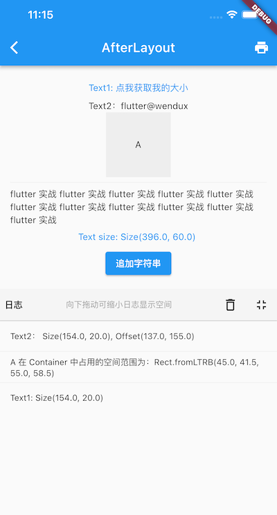

## 4.8 LayoutBuilder、AfterLayout

## 4.8.1 LayoutBuilder

通过 LayoutBuilder，我们可以在**布局过程**中拿到父组件传递的约束信息，然后我们可以根据约束信息动态的构建不同的布局。

比如我们实现一个响应式的 Column 组件 ResponsiveColumn，它的功能是当当前可用的宽度小于 200 时，将子组件显示为一列，否则显示为两列。简单来实现一下：

```dart
class ResponsiveColumn extends StatelessWidget {
  const ResponsiveColumn({Key? key, required this.children}) : super(key: key);

  final List<Widget> children;

  @override
  Widget build(BuildContext context) {
    // 通过 LayoutBuilder 拿到父组件传递的约束，然后判断 maxWidth 是否小于200
    return LayoutBuilder(
      builder: (BuildContext context, BoxConstraints constraints) {
        if (constraints.maxWidth < 200) {
          // 最大宽度小于200，显示单列
          return Column(children: children, mainAxisSize: MainAxisSize.min);
        } else {
          // 大于200，显示双列
          var _children = <Widget>[];
          for (var i = 0; i < children.length; i += 2) {
            if (i + 1 < children.length) {
              _children.add(Row(
                children: [children[i], children[i + 1]],
                mainAxisSize: MainAxisSize.min,
              ));
            } else {
              _children.add(children[i]);
            }
          }
          return Column(children: _children, mainAxisSize: MainAxisSize.min);
        }
      },
    );
  }
}


class LayoutBuilderRoute extends StatelessWidget {
  const LayoutBuilderRoute({Key? key}) : super(key: key);

  @override
  Widget build(BuildContext context) {
    var _children = List.filled(6, Text("A"));
    // Column在本示例中在水平方向的最大宽度为屏幕的宽度
    return Column(
      children: [
        // 限制宽度为190，小于 200
        SizedBox(width: 190, child: ResponsiveColumn(children: _children)),
        ResponsiveColumn(children: _children),
        LayoutLogPrint(child:Text("xx")) // 下面介绍
      ],
    );
  }
}
```

可以发现 LayoutBuilder 的使用很简单，但是不要小看它，因为它非常实用且重要，它主要有两个使用场景：

1. 可以使用 LayoutBuilder 来根据设备的尺寸来实现响应式布局。
2. LayoutBuilder 可以帮我们高效排查问题。比如我们在遇到布局问题或者想调试组件树中某一个节点布局的约束时 LayoutBuilder 就很有用。

### 打印布局时的约束信息

为了便于排错，我们封装一个能打印父组件传递给子组件约束的组件：

```dart
class LayoutLogPrint<T> extends StatelessWidget {
  const LayoutLogPrint({
    Key? key,
    this.tag,
    required this.child,
  }) : super(key: key);

  final Widget child;
  final T? tag; //指定日志tag

  @override
  Widget build(BuildContext context) {
    return LayoutBuilder(builder: (_, constraints) {
      // assert在编译release版本时会被去除
      assert(() {
        print('${tag ?? key ?? child}: $constraints');
        return true;
      }());
      return child;
    });
  }
}
```

这样，我们就可以使用 LayoutLogPrint 组件树中任意位置的约束信息，比如：

```dart
LayoutLogPrint(child:Text("xx"))
```

控制台输出：

```
flutter: Text("xx"): BoxConstraints(0.0<=w<=428.0, 0.0<=h<=823.0)
```

可以看到 Text("xx") 的显示空间最大宽度为 428，最大高度为 823 。

> 注意！我们的大前提是盒模型布局，如果是Sliver 布局，可以使用 SliverLayoutBuiler 来打印。

完整的示例运行后效果如下：


## 4.8.2 AfterLayout

Flutter 是响应式UI框架，而命令式UI框架最大的不同就是：大多数情况下开发者只需要关注数据的变化，数据变化后框架会自动重新构建UI而不需要开发者手动去操作每一个组件，所以我们会发现 Widget 会被定义为不可变的（immutable），并且没有提供任何操作组件的 API，因此如果我们想在 Flutter 中获取某个组件的大小和位置就会很困难，当然大多数情况下不会有这个需求，但总有一些场景会需要，而在命令式UI框架中是不会存在这个问题的。

我们知道，只有当布局完成时，每个组件的大小和位置才能确定，所以获取的时机肯定是布局完成后，那布局完成的时机如何获取呢？至少事件分发肯定是在布局完成之后的，比如：

```dart
Builder(
  builder: (context) {
    return GestureDetector(
      child: Text('flutter@wendux'),
      onTap: () => print(context.size), //打印 text 的大小
    );
  },
),
```

`context.size` 可以获取当前上下文 RenderObject 的大小，对于Builder、StatelessWidget 以及 StatefulWidget 这样没有对应 RenderObject 的组件（这些组件只是用于组合和代理组件，本身并没有布局和绘制逻辑），获取的是子代中第一个拥有 RenderObject 组件的 RenderObject 对象。

虽然事件点击时可以拿到组件大小，但有两个问题，第一是需要用户手动触发，第二是时机较晚，更多的时候我们更希望在布局一结束就去获取大小和位置信息，为了解决这个问题，笔者封装了一个 AfterLayout 组件，它可以在子组件布局完成后执行一个回调，并同时将 RenderObject 对象作为参数传递。

> 注意，AfterLayout 是笔者自定义的组件，并非 Flutter 组件库中自带组件，读者可以在随书源码中查看实现源码和示例，本节主要讲它的功能， AfterLayout 的实现原理我们将在本书后面布局原理相关章节中介绍。

### 获取组件大小和相对于屏幕的坐标

```dart
AfterLayout(
  callback: (RenderAfterLayout ral) {
    print(ral.size); //子组件的大小
    print(ral.offset);// 子组件在屏幕中坐标
  },
  child: Text('flutter@wendux'),
),
```

运行后控制台输出：

```
flutter: Size(105.0, 17.0)
flutter: Offset(42.5, 290.0)
```

可以看到 Text 文本的实际长度是 105，高度是 17，它的启示位置坐标是（42.5, 290.0）。

### 获取组件相对于某个父组件的坐标

RenderAfterLayout 类继承自 RenderBox，RenderBox 有一个 localToGlobal 方法，它可以将坐标转化为相对与指定的祖先节点的坐标，比如下面代码可以打印出 Text('A') 在 父 Container 中的坐标

```dart
Builder(builder: (context) {
  return Container(
    color: Colors.grey.shade200,
    alignment: Alignment.center,
    width: 100,
    height: 100,
    child: AfterLayout(
      callback: (RenderAfterLayout ral) {
        Offset offset = ral.localToGlobal(
          Offset.zero,
          // 传一个父级元素
          ancestor: context.findRenderObject(),
        );
        print('A 在 Container 中占用的空间范围为：${offset & ral.size}');
      },
      child: Text('A'),
    ),
  );
}),
```

### AfterLayout 实例

```dart
class AfterLayoutRoute extends StatefulWidget {
  const AfterLayoutRoute({Key? key}) : super(key: key);

  @override
  _AfterLayoutRouteState createState() => _AfterLayoutRouteState();
}

class _AfterLayoutRouteState extends State<AfterLayoutRoute> {
  String _text = 'flutter 实战 ';
  Size _size = Size.zero;

  @override
  Widget build(BuildContext context) {
    return Column(
      mainAxisSize: MainAxisSize.min,
      children: [
        Padding(
          padding: const EdgeInsets.all(8.0),
          child: Builder(
            builder: (context) {
              return GestureDetector(
                child: Text(
                  'Text1: 点我获取我的大小',
                  textAlign: TextAlign.center,
                  style: TextStyle(color: Colors.blue),
                ),
                onTap: () => print('Text1: ${context.size}'),
              );
            },
          ),
        ),
        AfterLayout(
          callback: (RenderAfterLayout ral) {
            print('Text2： ${ral.size}, ${ral.offset}');
          },
          child: Text('Text2：flutter@wendux'),
        ),
        Builder(builder: (context) {
          return Container(
            color: Colors.grey.shade200,
            alignment: Alignment.center,
            width: 100,
            height: 100,
            child: AfterLayout(
              callback: (RenderAfterLayout ral) {
                Offset offset = ral.localToGlobal(
                  Offset.zero,
                  ancestor: context.findRenderObject(),
                );
                print('A 在 Container 中占用的空间范围为：${offset & ral.size}');
              },
              child: Text('A'),
            ),
          );
        }),
        Divider(),
        AfterLayout(
          child: Text(_text), 
          callback: (RenderAfterLayout value) {
            setState(() {
              //更新尺寸信息
              _size = value.size;
            });
          },
        ),
        //显示上面 Text 的尺寸
        Padding(
          padding: const EdgeInsets.symmetric(vertical: 8.0),
          child: Text(
            'Text size: $_size ',
            style: TextStyle(color: Colors.blue),
          ),
        ),
        ElevatedButton(
          onPressed: () {
            setState(() {
              _text += 'flutter 实战 ';
            });
          },
          child: Text('追加字符串'),
        ),
      ],
    );
  }
}
```

运行后效果如下图所示：



运行后点击 Text1 就可以在日志面板看到它的大小。点击 “追加字符串” 按钮，字符串大小变化后，屏幕上上也会显示（按钮上方挨着）。

## 4.8.3 Flutter 的 build 和 layout

通过观察 LayoutBuilder 的示例，我们还可以发现一个关于 Flutter 构建（build）和 布局（layout）的结论：**Flutter 的build 和 layout 是可以交错执行的**，并不是严格的按照先 build 再 layout 的顺序。比如在上例中 ，在build过程中遇到了 LayoutBuilder 组件，而 LayoutBuilder的 builder 是在 layout 阶段执行的（layout阶段才能取到布局过程的约束信息），在 builder 中新新建了一个 widget 后，Flutter 框架随后会调用该 widget 的 build 方法，又进入了build阶段。
