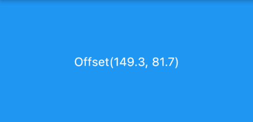

# 8.1 原始指针事件处理

本节先来介绍一下原始指针事件(Pointer Event，在移动设备上通常为触摸事件)，下一节再介绍手势处理。

在移动端，各个平台或UI系统的原始指针事件模型基本都是一致，即：一次完整的事件分为三个阶段：手指按下、手指移动、和手指抬起，而更高级别的手势（如点击、双击、拖动等）都是基于这些原始事件的。

当指针按下时，Flutter会对应用程序执行**命中测试(Hit Test)**，以确定指针与屏幕接触的位置存在哪些组件（widget）， 指针按下事件（以及该指针的后续事件）然后被分发到由命中测试发现的最内部的组件，然后从那里开始，事件会在组件树中向上冒泡，这些事件会从最内部的组件被分发到组件树根的路径上的所有组件，这和Web开发中浏览器的**事件冒泡**机制相似， 但是Flutter中没有机制取消或停止“冒泡”过程，而浏览器的冒泡是可以停止的。注意，只有通过命中测试的组件才能触发事件。

> 属于“Hit Test ”的中文翻译比较多，如 “命中测试”、“点击测试” ，对于名字我们不用较真，知道它们代表的是 “Hit Test ” 即可。

Flutter中可以使用`Listener`来监听原始触摸事件，按照本书对组件的分类，则`Listener`也是一个功能性组件。下面是`Listener`的构造函数定义：

```dart
Listener({
  Key key,
  this.onPointerDown, //手指按下回调
  this.onPointerMove, //手指移动回调
  this.onPointerUp,//手指抬起回调
  this.onPointerCancel,//触摸事件取消回调
  this.behavior = HitTestBehavior.deferToChild, //先忽略此参数，后面小节会专门介绍
  Widget child
})
```

我们先看一个示例，下面代码功能是： 手指在一个容器上移动时查看手指相对于容器的位置。

```dart
class _PointerMoveIndicatorState extends State<PointerMoveIndicator> {
  PointerEvent? _event;

  @override
  Widget build(BuildContext context) {
    return Listener(
      child: Container(
        alignment: Alignment.center,
        color: Colors.blue,
        width: 300.0,
        height: 150.0,
        child: Text(
          '${_event?.localPosition ?? ''}',
          style: TextStyle(color: Colors.white),
        ),
      ),
      onPointerDown: (PointerDownEvent event) => setState(() => _event = event),
      onPointerMove: (PointerMoveEvent event) => setState(() => _event = event),
      onPointerUp: (PointerUpEvent event) => setState(() => _event = event),
    );
  }
}
```

运行后效果如图8-1所示：



手指在蓝色矩形区域内移动即可看到当前指针偏移，当触发指针事件时，参数 `PointerDownEvent`、 `PointerMoveEvent`、 `PointerUpEvent` 都是`PointerEvent`的子类，`PointerEvent`类中包括当前指针的一些信息，注意 Pointer，即“指针”， 指事件的触发者，可以是鼠标、触摸板、手指。

如：

- `position`：它是指针相对于当对于全局坐标的偏移。
- `localPosition`: 它是指针相对于当对于全局坐标的偏移
- `delta`：两次指针移动事件（`PointerMoveEvent`）的距离。
- `pressure`：按压力度，如果手机屏幕支持压力传感器(如iPhone的3D Touch)，此属性会更有意义，如果手机不支持，则始终为1。
- `orientation`：指针移动方向，是一个角度值。

上面只是`PointerEvent`一些常用属性，除了这些它还有很多属性，读者可以查看API文档。

还有一个`behavior`属性，它决定子组件如何响应命中测试，关于该属性我们将在后面 “事件处理流程” 一节中详细介绍。

### 忽略指针事件

假如我们不想让某个子树响应`PointerEvent`的话，我们可以使用`IgnorePointer`和`AbsorbPointer`，这两个组件都能阻止子树接收指针事件，不同之处在于`AbsorbPointer`本身会参与命中测试，而`IgnorePointer`本身不会参与，这就意味着`AbsorbPointer`本身是可以接收指针事件的(但其子树不行)，而`IgnorePointer`不可以。一个简单的例子如下：

```dart
Listener(
  child: AbsorbPointer(
    child: Listener(
      child: Container(
        color: Colors.red,
        width: 200.0,
        height: 100.0,
      ),
      onPointerDown: (event)=>print("in"),
    ),
  ),
  onPointerDown: (event)=>print("up"),
)
```

点击`Container`时，由于它在`AbsorbPointer`的子树上，所以不会响应指针事件，所以日志不会输出"in"，但`AbsorbPointer`本身是可以接收指针事件的，所以会输出"up"。如果将`AbsorbPointer`换成`IgnorePointer`，那么两个都不会输出。

